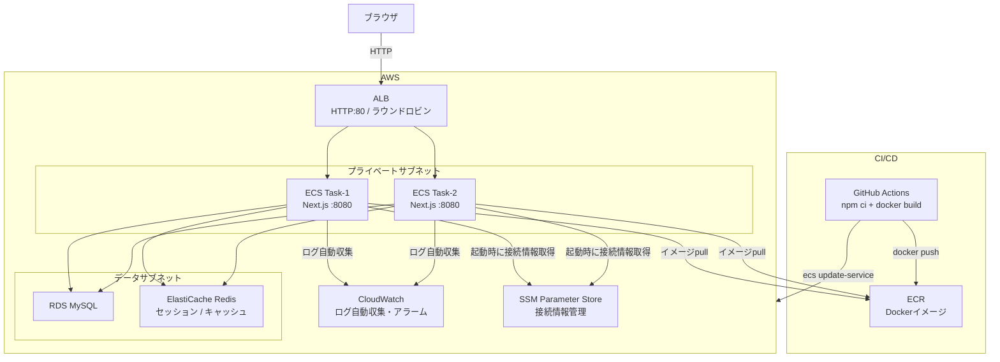
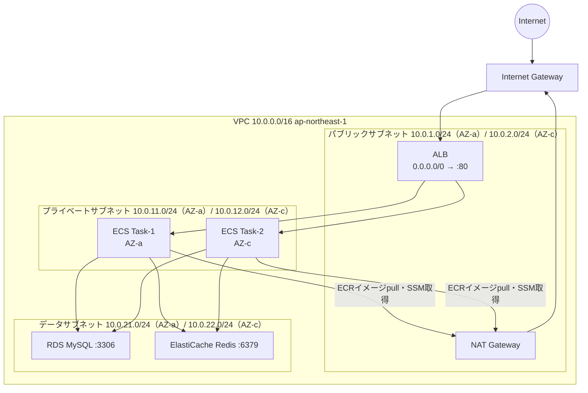
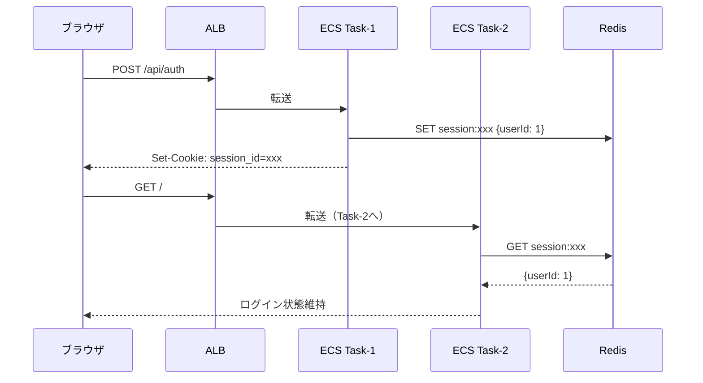
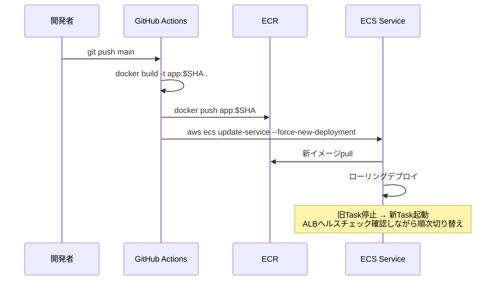

# アーキテクチャ・構成詳細

## アーキテクチャ全体図



---

## VPC構成図



### セキュリティグループ経路

| 送信元 | 宛先 | ポート | 理由 |
|---|---|---|---|
| `0.0.0.0/0` | ALB SG | 80 | ユーザーからのHTTPアクセス |
| ALB SG | ECS Task SG | 8080 | ALBからコンテナへの転送 |
| ECS Task SG | RDS SG | 3306 | アプリからDBアクセス |
| ECS Task SG | Redis SG | 6379 | アプリからRedisアクセス |

---

## セッション共有の仕組み

### Redis によるセッション共有



---

## CI/CDデプロイフロー



EC2と違い、**ECSがローリングデプロイを自動で管理**します。

---

## 各ファイルの役割

### アプリ

| ファイル | 役割 |
|---|---|
| `src/app/page.tsx` | Server Component。DBからアイテム取得してHTMLを返す |
| `src/app/items/[id]/page.tsx` | アイテム詳細。Redisキャッシュ経由でDB取得 |
| `src/app/api/auth/route.ts` | ログイン・ログアウト。セッションをRedisに保存 |
| `src/app/api/health/route.ts` | `{ status: "ok" }` を返すだけ。ALBヘルスチェック用 |
| `src/lib/db.ts` | Prisma clientのシングルトン |
| `src/lib/redis.ts` | ioredis clientのシングルトン |
| `src/lib/session.ts` | Cookie↔Redisのセッション読み書きユーティリティ |
| `src/components/TaskBadge.tsx` | `HOSTNAME` 環境変数（ECSタスクID）を表示。ALBラウンドロビンの目視確認用 |

### Dockerfile（マルチステージビルド）

```dockerfile
FROM node:20-alpine AS builder
WORKDIR /app
COPY package*.json ./
RUN npm ci
COPY . .
RUN npm run build

FROM node:20-alpine AS runner
WORKDIR /app
ENV NODE_ENV=production
ENV PORT=8080
COPY --from=builder /app/.next/standalone ./
COPY --from=builder /app/.next/static ./.next/static
COPY --from=builder /app/public ./public
EXPOSE 8080
CMD ["node", "server.js"]
```

standaloneモードで最小構成のイメージを作る。

### インフラ（Terraform）

| ファイル | 役割 |
|---|---|
| `vpc.tf` | VPC・サブネット×6・IGW・NATゲートウェイ・ルートテーブル |
| `sg.tf` | セキュリティグループ×4（ALB・ECS Task・RDS・Redis） |
| `alb.tf` | ALB・ターゲットグループ（IPタイプ）・リスナー・ヘルスチェック |
| `ecr.tf` | ECRリポジトリ（イメージの置き場） |
| `ecs.tf` | ECSクラスター・タスク定義・サービス（desired count=2）・IAMロール |
| `rds.tf` | RDS MySQL・サブネットグループ |
| `elasticache.tf` | ElastiCache Redisクラスター（1ノード） |
| `cloudwatch.tf` | ロググループ・アラーム（CPU・5xx） |
| `ssm.tf` | Parameter Store（DB接続文字列・Redisホスト・セッションシークレット） |

### EC2との主な違い

| | EC2 | ECS Fargate |
|---|---|---|
| サーバー管理 | userdata.sh・pm2 | 不要（Dockerコンテナ） |
| デプロイ | S3→SSM→差し替え→再起動 | ECR push → update-service |
| ローリングデプロイ | deploy.shで手動制御 | ECSが自動管理 |
| ログ収集 | CW Agentインストール必要 | タスク定義で自動収集 |
| ALBターゲット登録 | インスタンスID | IPアドレス（タスクのENI） |
